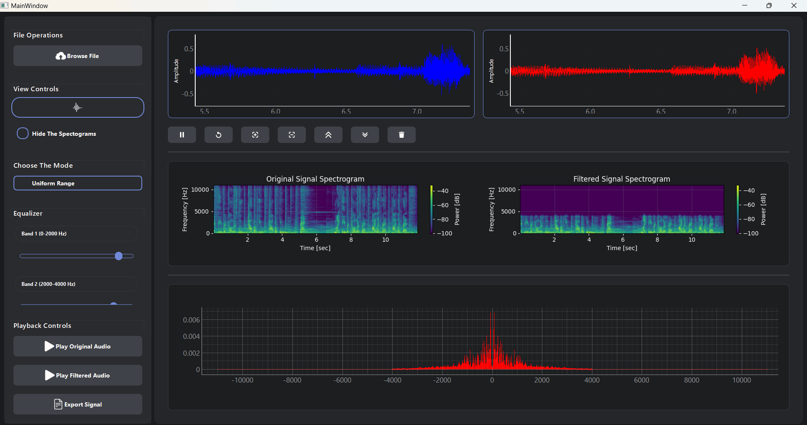
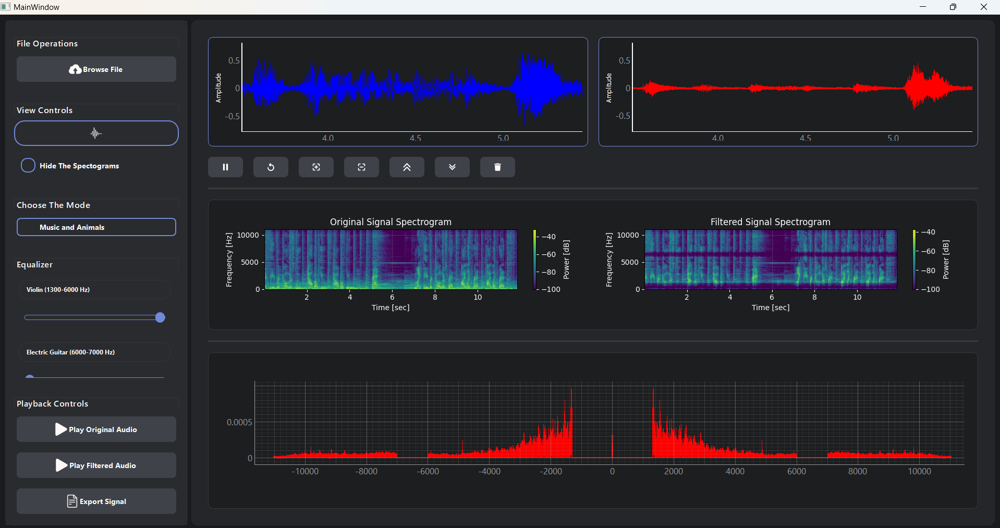
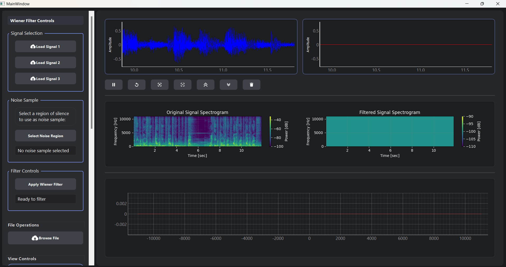
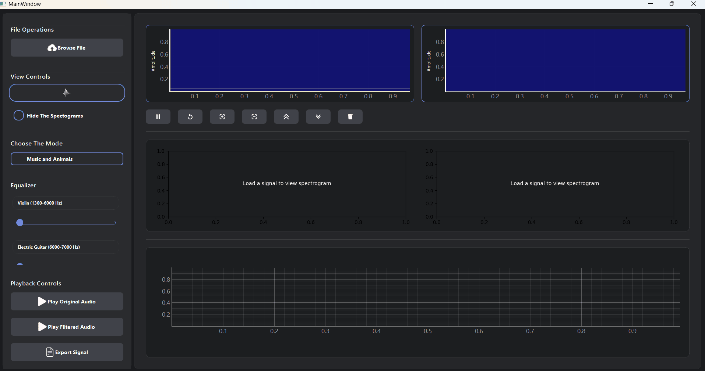

# Signal-Equalizer

# Signal Equalizer Application

## Introduction

The Signal Equalizer is a versatile desktop application designed for modifying the magnitude of specific frequency components in audio and other signal types. This tool is widely used in music, speech, and biomedical applications, such as hearing aids and ECG analysis.

## Features

1. **Multiple Modes of Operation**:
   - **Uniform Range Mode**: Divides the total frequency range into 10 equal segments, each controlled by a slider.
   

   - **Music and animals Mode**: Allows control of the magnitude of specific musical instruments and animals sounds in a mixed signal.
   

   - **Music and vowels mode**: Enables control of the magnitude of specific music instruments sounds and specific vowels from real life song.
   
   - **Wiener filter mode**:
     
   

2. **Fourier Transform Visualization**:
   - Displays the Fourier transform of the input signal.
   - Allows switching between **linear scale** and **Audiogram scale** for frequency visualization.

3. **Linked Cine Signal Viewers**:
   - Synchronized viewers for input and output signals.
   - Full functionality, including play, stop, pause, speed control, zoom, pan, and reset.

4. **Spectrograms**:
   - Visual representation of the input and output signals' frequency content.
   - Automatically updates to reflect slider changes.
   - Option to toggle spectrogram visibility.

5. **Intuitive UI**:
   - Seamless switching between modes via menus or dropdowns.
   - Dynamically updated slider labels and functionality based on the selected mode.
     
   *Screenshot for UI*
   

## Usage

1. **Load a Signal**:
   - Open a WAV or other supported file format.

2. **Choose a Mode**:
   - Select one of the four available modes:
     - Uniform Range Mode
     - Music and Animals Mode
     - Music and vowels Mode
     - Wiener Filter Mode

3. **Adjust Sliders**:
   - Modify frequency components using sliders.
   - Observe real-time updates in the output spectrogram and signal viewer.

4. **Save Output**:
   - Save the modified signal as a new file.

## Notes

- Ensure proper slider-to-frequency mapping in non-uniform modes.
- The Fourier transform visualization is crucial for validating frequency manipulations.
- Synchronized cine viewers ensure an accurate time-domain representation.

